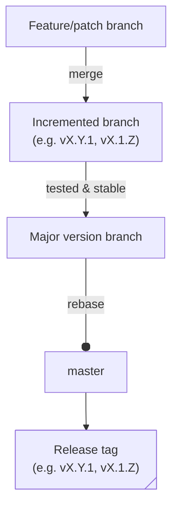

# Actions

ProjectDiscovery's composite actions.

## Releases

* default HEAD branch (**`master`**) - latest code changes and updates, which *might* not have undergone thorough testing and quality assurance; **use at your own risk**.
* Major version branch (e.g. **`vN`**) - contains stable releases; **considered production-ready**.
* **`dotfiles`** branch - contains configuration files for setting up development environments used across actions. This branch is **NOT** subject to frequent changes; **modify with caution**.

## Development

Add a workflow test for each new action to ensure quality and reliability and make sure new changes **DO NOT** break existing functionality so that it can be promoted to the major version branch.

> For maintainers:

When creating release tags, follow the SemVer format (`vX.Y.Z`).

> [!NOTE]
> All changes must be applied to the default HEAD branch as well as the respective major version branch.

## License

MIT.